# 6. Node.js 入門之 Express.js 實戰

## 6.1 MVC 架構
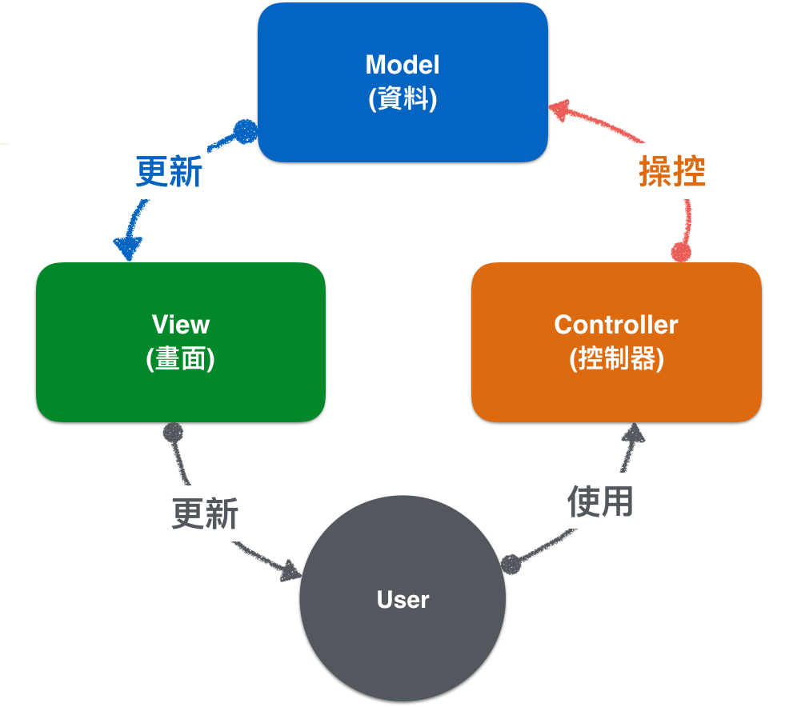

- [MVC - 維基百科，自由的百科全書](https://zh.wikipedia.org/wiki/MVC)

>MVC模式（Model–view–controller）是軟體工程中的一種軟體架構模式，把軟體系統分為三個基本部分：模型（Model）、視圖（View）和控制器（Controller）。

- 控制器（Controller）- 負責轉發請求，對請求進行處理。
- 視圖（View） - 介面設計人員進行圖形介面設計。
- 模型（Model） - 程式設計師編寫程式應有的功能（實現演算法等等）、資料庫專家進行資料管理和資料庫設計(可以實現具體的功能)。

---

## 6.2 RESTful API

`RESTful` 指的是滿足 `REST(Representational State Transfer)` 風格的 API 設計，而 `Rest` 不是標準，是一種業界常見的**設計風格**。

### 6.2.1 主要特性

- 客戶-伺服器（Client-Server）
通訊只能由用戶端單方面發起，表現為請求-回應的形式。

- 無狀態（Stateless）
通訊的對談狀態（Session State）應該全部由用戶端負責維護。

- 快取（Cache）
回應內容可以在通訊鏈的某處被快取，以改善網路效率。

- 統一介面（Uniform Interface）
通訊鏈的元件之間通過統一的介面相互通訊，以提高互動的可見性。

- 分層系統（Layered System）
通過限制元件的行為（即每個元件只能「看到」與其互動的緊鄰層），將架構分解為若干等級的層。

### 6.2.2 路徑 (Endpoint)

RESTful API 的 `路徑 (Endpoint)` 表示 API 的入口網址，也就是要存取一組 API 的具體位置。

一般來說，`RESTful API` 會有自己的專用域名，或是特別的路徑：

```
https://api.example.com
||
https://example.org/api/
```

RESTful API 的每組網址都代表**一種特定的資源（resource）**，所以網址中不會有動詞，只會包含名詞。

要如何操作該資源的動作由 **HTTP 動作 (Method)** 指定。

一般來說，API 網址使用的名詞往往會跟**資料庫中的表格對應**，其回傳值可能是包含所有使用者的清單，也可能是一個使用者的詳細資料，所以定義 API 網址名詞是否為單數或複數，是會由**操作該 API 所回傳的資料類型決定**。

舉例來說，資料庫中有 `User` 這個資料表，而我們需要設計取得以下幾種資料：

- 取得全部的 `Users`（清單/陣列）
- 依據 ID 取得特定的 `User`

那我們會這樣設計：

```
// 取得全部的 Users
https://api.example.com/users

// 取得 ID === 1 的 User
https://api.example.com/user/1
```

### 6.2.3 HTTP 動作 (Method)

符合 RESTful 風格的 API 設計通常會透過這四種動詞操作 API。

而它們通常也分別對應 SQL 資料庫的特定查詢動作。

```
GET（SELECT）：由 server 取出資料。
POST（CREATE）：在 server 建立一筆新資料。
PUT（UPDATE）：經由 client 端提供的資料，更改 server 端已存在的資料。
DELETE（DELETE）：刪除在 server 上的資料。
```

### 6.2.4 參考
- [具象狀態傳輸 - 維基百科，自由的百科全書](https://zh.wikipedia.org/wiki/%E5%85%B7%E8%B1%A1%E7%8A%B6%E6%80%81%E4%BC%A0%E8%BE%93)
- [RESTful API 设计指南 - 阮一峰的网络日志](http://www.ruanyifeng.com/blog/2014/05/RESTful_api.html)

---

## 6.3 Express 框架

### 6.3.1 使用 express-generator

`express-generator` 是一個 express 的應用程式產生器，它可以用來建立最基本的 express app 模板。

使用以下指令，會依序開啟一個乾淨的目錄、安裝 `express-generator` 與建立一個叫做 `website` 的 express app。

```shell
$ mkdir express
$ npm install express-generator -g
$ express website
$ cd website && npm install
```

安裝完成之後，使用以下指令啟動。

```shell
$ npm start
```

`Express` 預設監聽 port 3000 來提供服務，打開 `http://localhost:3000` 應該可看到結果。

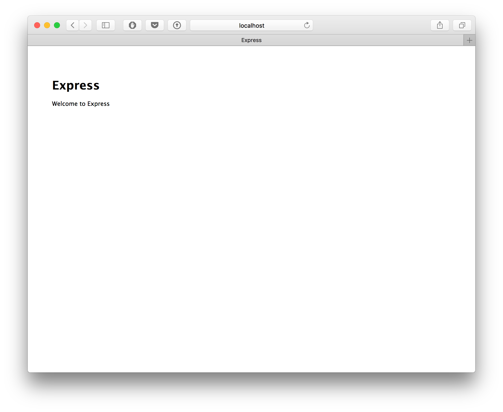

產生的 app 具有以下結構：

```.
├── app.js
├── bin
│   └── www
├── package.json
├── public
│   ├── images
│   ├── javascripts
│   └── stylesheets
│       └── style.css
├── routes
│   ├── index.js
│   └── users.js
└── views
    ├── error.pug
    ├── index.pug
    └── layout.pug

7 directories, 9 files
```

## 6.4 Ejs Render Enging

> EJS, Effective JavaScript templating

EJS 是一套簡單且上手快速的樣版引擎，可以使用 JavaScript 語法由後端帶入資料，產生 HTML 結構。

- [EJS-playground](https://ionicabizau.github.io/ejs-playground/)

### 6.4.1 什麼是樣版引擎

### 6.4.2 EJS 特性 - 使用 tag

- `<%` 'Scriptlet' tag, for control-flow, no output
```html
  <%
    var a = 10;
    var b = 11;
  %>
  <% if (a === 11) { %> 
    <span>a = 11!</span>
  <% } %>
  <% if (b === 11) { %> 
    <span>b = 11!</span>
  <% } %>
```

- `<%%` Outputs a literal '<%'
```
  <b><%%</b>兩個 % 符號表示跳脫 EJS 樣板字元，只會輸出一組 < 與 %。
```

- `<%=` Outputs the value into the template (HTML escaped)
```html
  <b><%%=</b>表示輸出經過 HTML 跳脫處理的字串：<%= "\"&quot 123 &quot\"" %>。
```

- `<%-` Outputs the unescaped value into the template
```html
  <b><%%-</b>表示輸出*未*經過 HTML 跳脫處理的字串：<%- "\"&quot 123 &quot\"" %>。
```

- `<%#` Comment tag, no execution, no output
```html
  <b><%%#-</b>表示這是一行註解：
  <%# "\"&quot 123 &quot\"" %>。
```

- `%>` Plain ending tag
```
  <b>%%></b>表示正常輸出，不對 EJS 造成的換行做處理。
  <% for (var i =0; i < 10; ++i) { %>
      - <%- i %>
  <% } %>
```

- `-%>` Trim-mode ('newline slurp') tag, trims following newline
```
  <b>-%></b>表示 trim 輸出，清除換行<%= '\n' %>。
  <% for (var i =0; i < 10; ++i) { %>
      - <%- i -%>
  <% } %>
```

### 6.4.2 EJS 特性 - 使用 includes

- 將模板引入，類似 Node.js 的 `required`。
```
<ul>
  <% users.forEach(function(user){ %>
    <%- include('user/show', {user: user}); %>
  <% }); %>
</ul>
```

### 6.4.3 其他樣版引擎
- Vash
- Mustache
- Dust.js
- Nunjucks
- Handlebars
- atpl
- haml
- [Pug(Jade)](https://pugjs.org/api/getting-started.html)
  - [HTML2Jade - HTML to Jade Online Realtime Converter](http://html2jade.org/)

#### > HTML
```html
<!DOCTYPE html>
<html lang="en">
  <head>
    <title>Jade</title>
    <script type="text/javascript">
      foo = true;
      bar = function () {};
      if (foo) {
        bar(1 + 5)
      }
    </script>
  </head>
  <body>
    <h1>Jade - node template engine</h1>
    <div id="container" class="col">
      <p>You are amazing</p>
      <p>Jade is a terse and simple
         templating language with a
         strong focus on performance
         and powerful features.</p>
    </div>
  </body>
</html>
```

#### > Pug(Jade)
```jade
doctype html
html(lang='en')
  head
    title Jade
    script(type='text/javascript').
      foo = true;
      bar = function () {};
      if (foo) {
      bar(1 + 5)
      }
  body
    h1 Jade - node template engine
    #container.col
      p You are amazing
      p
        | Jade is a terse and simple
        | templating language with a
        | strong focus on performance
        | and powerful features.

```

#### 6.4.4 參考
- [EJS -- Embedded JavaScript templates](http://ejs.co/)

---

## 6.5 使用資料庫 ORM - Sequelize.js 

### 6.5.1 什麼是 ORM

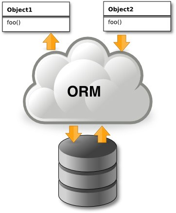

> [圖片來源](http://tackmobile.com/blog/images/ORMpt1/ORM.jpg)

`ORM(Object-Relational Mapping)`，意指一套介於程式端與資料庫中間的虛擬介面，負責將資料庫物件化。

它可以使我們不需要直接使用 SQL 語法，轉而以操作屬性與方法來讀寫資料庫。

例如，以下這兩段查詢的結果是相等的：

```javascript
User.findAll({
  offset: 0,
  limit: 1000,
});
```

```sql
SELECT * FROM `Users` LIMIT 0,1000;
```

### 6.5.2 model 與欄位定義範例

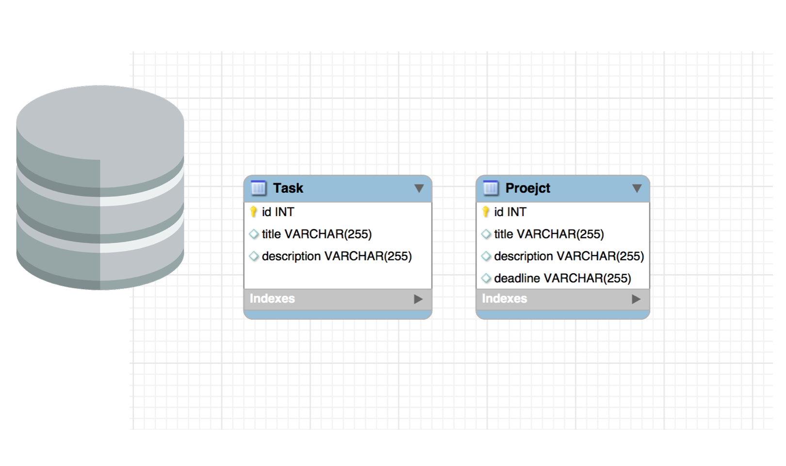

上圖等於以下程式碼：

```javascript
const Project = sequelize.define('Project', {
  title: Sequelize.STRING,
  description: Sequelize.TEXT
});

const Task = sequelize.define('Task', {
  title: Sequelize.STRING,
  description: Sequelize.TEXT,
  deadline: Sequelize.DATE
});
```

### 6.5.3 關聯定義與範例

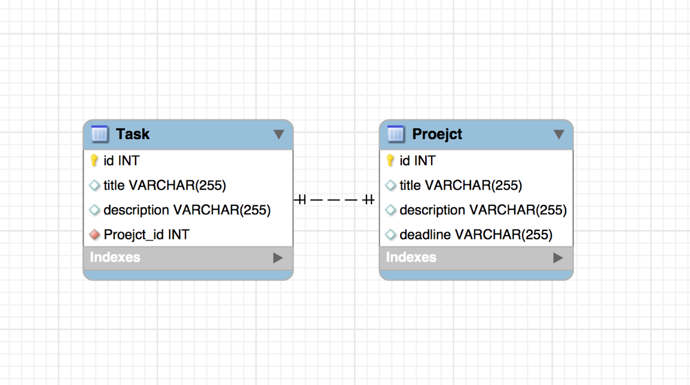

上圖等於以下程式碼：

```javascript
const Project = sequelize.define('Project', {
  title: Sequelize.STRING,
  description: Sequelize.TEXT
});

const Task = sequelize.define('Task', {
  title: Sequelize.STRING,
  description: Sequelize.TEXT,
  deadline: Sequelize.DATE
});
Task.belongsTo(Project);
```

### 6.5. 參考
- [Sequelize | The node.js ORM for PostgreSQL, MySQL, SQLite and MSSQL](http://docs.sequelizejs.com/)

---

## 6.6 開發工具上手

### 6.6.1 使用 PostMan
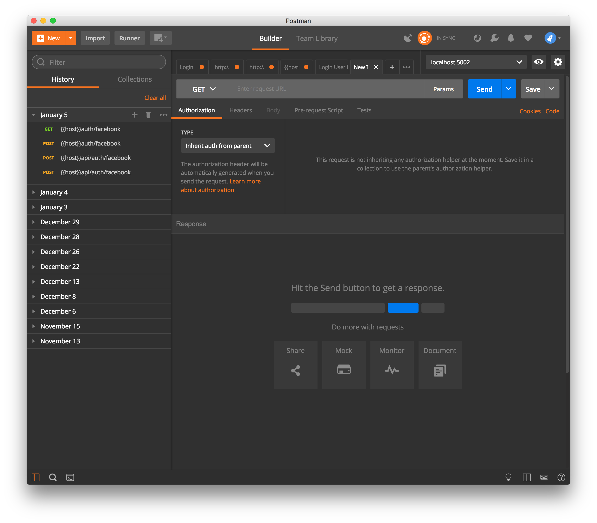

- [Windows download](https://app.getpostman.com/app/download/win64)

- [Mac download](https://app.getpostman.com/app/download/osx64?utm_source=site&utm_medium=apps&utm_campaign=macapp)

- [Linux download](https://app.getpostman.com/app/download/linux64)

#### A. 範例操作：取得 IP

- 使用 get method
- [ipify - A Simple Public IP Address API](https://www.ipify.org/)

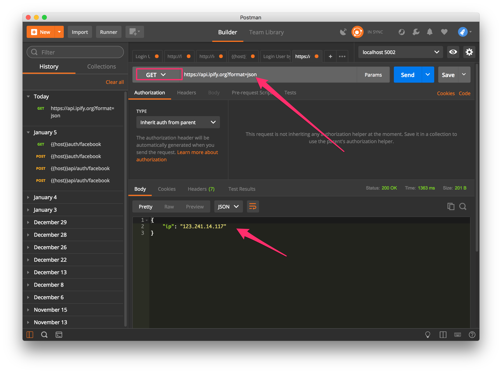

#### B. 範例操作：取得 Opendata 資料

- 使用 get method
- [即時天氣資料 | 政府資料開放平臺](https://data.gov.tw/dataset/45131)

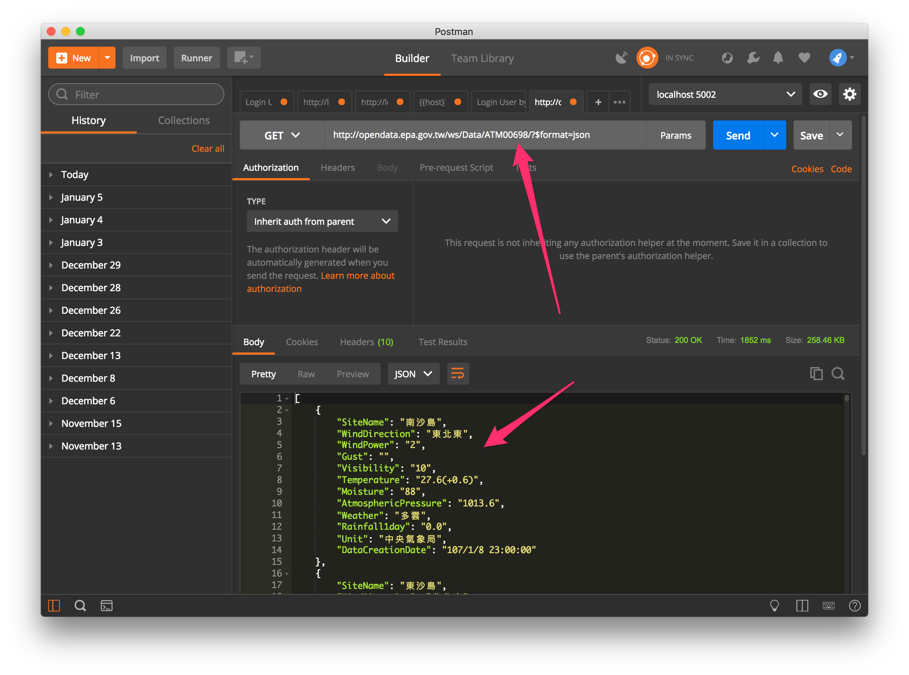

#### C. 範例操作：與參數透過 Faker.js 取得資料

- 使用 get method 與 query parameter
- [faker.hook.io/?property](http://faker.hook.io/?property)
- [faker.hook.io/?property=name.findName](http://faker.hook.io/?property=name.findName)

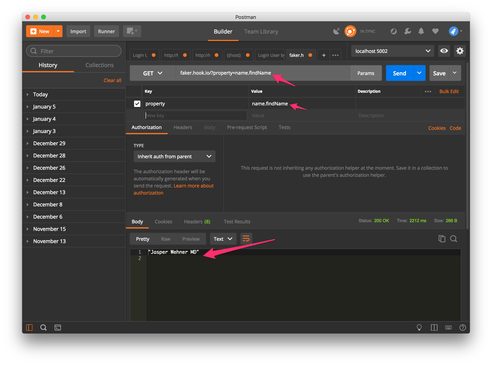

#### D. 範例操作：使用 post

- 使用 post method 與 form body
- [My JSON Server - Fake online REST server for teams](https://my-json-server.typicode.com/)
- https://my-json-server.typicode.com/typicode/demo/posts

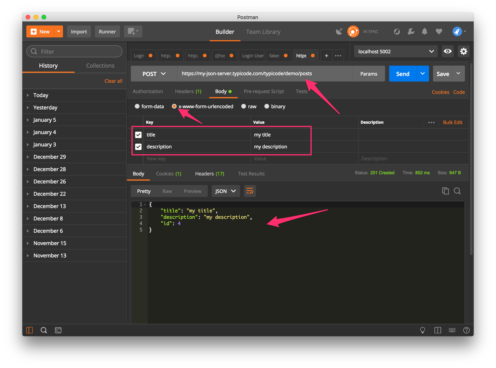

### 6.6.2 DB Browser for SQLite

- [DB Browser for SQLite | Website](http://sqlitebrowser.org/)

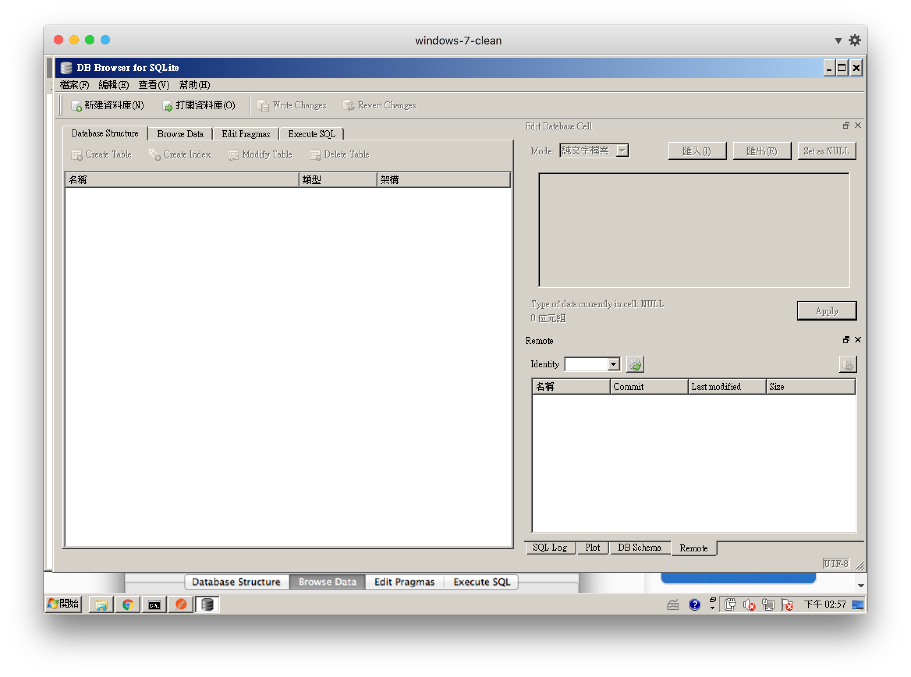

#### A. 安裝
- [Windows](https://github.com/sqlitebrowser/sqlitebrowser/releases/download/v3.10.1/DB.Browser.for.SQLite-3.10.1-win64.exe)
- [Mac](https://github.com/sqlitebrowser/sqlitebrowser/releases/download/v3.10.1/DB.Browser.for.SQLite-3.10.1.dmg)
- [Linux](https://github.com/sqlitebrowser/sqlitebrowser/archive/v3.10.1.tar.gz)

#### B. 開啟資料庫

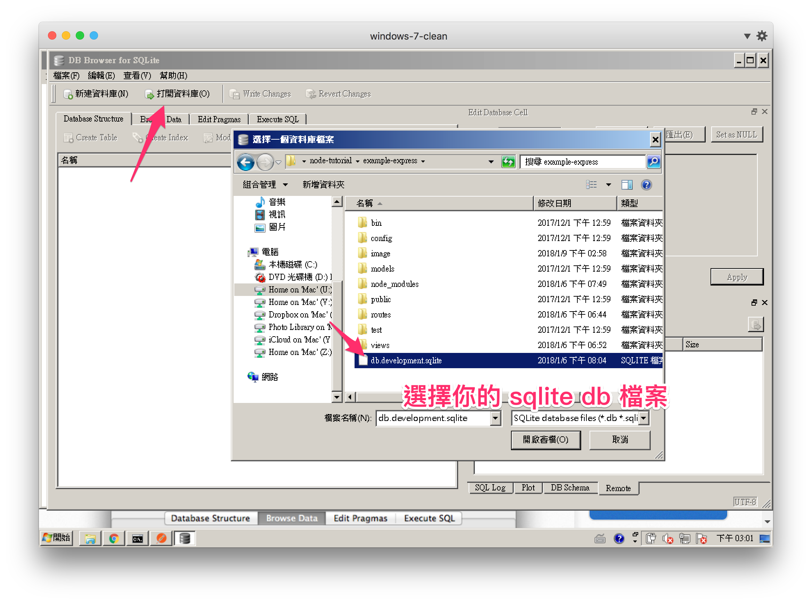

#### C. 變更資料庫

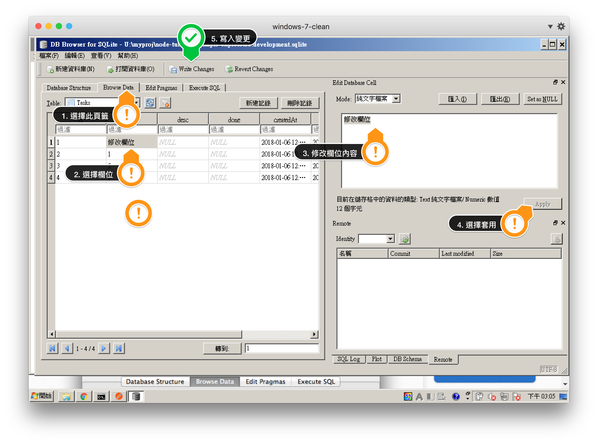

### 6.6.3 使用 Chrome DevTool
#### A. Network 頁籤 - 觀察 request 狀態

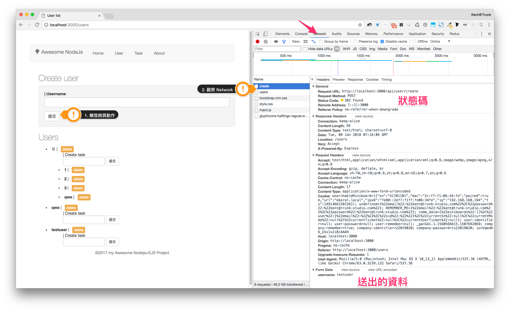

---

## 6.7 Express.js + Sequelize.js 上手實戰

請先 clone 這個專案：[iamcxa/express-starter-kit: Express + Sequelize.js + EJS](https://github.com/iamcxa/express-starter-kit)

這是一個基於 `Express` templete，同時結合 `Sequelize.js` 與 `EJS` 的 starter kit。

### 6.7.1 Express route 解說

```.
├── routes
│   ├── index.js
│   └── api.js
└── views
    ├── error.ejs
    ├── index.ejs
    └── layout.ejs
```

```javascript
const models = require('../models');
const express = require('express');

const router = express.Router();

// 首頁
router.get('/', async (req, res) => {
  const users = await models.User.findAll({
    include: [models.Task],
  });

  return res.render('index', {
    title: 'Sequelize: Express Example',
    data: {
      users,
    },
  });
});

// 使用者清單
router.get('/users', async (req, res) => {
  const users = await models.User.findAll();

  return res.render('user', {
    title: 'User list',
    data: {
      users,
    },
  });
});
module.exports = router;
```

### 6.7.2 User table 解說

```javascript
module.exports = (sequelize, DataTypes) => {
  const User = sequelize.define('User', {
    username: DataTypes.STRING,
  });

  return User;
};
```

### 6.7.3 製作一個關於網站頁面 - view

<!-- - about 

### 6.7.4 修改資料表欄位與更新畫面 - model（新建一個 todo 資料表關聯到 user）

#### 6.7.4.1 修改資料表 - model（新增 todo）

#### 6.7.4.2 更新畫面（讓 user 同時撈出 todo 資料表的資料）

### 6.7.5 新增一隻 API 取得資料 - controler

#### 6.7.5.1 修改 route（新增route可以增刪查改todo表）

#### 6.7.5.2 更新畫面（讓畫面有按鈕可以新增與刪除todo） -->

### 6.7.6 新增一個完整的功能（TODO List）

- 說明
  - 可以選取使用者，列出該使用者的全部 task
  - 可以新增 task
  - 可以修改 task 狀態
  - 可以刪除存在的 task

#### 6.7.6.1 修改 model 定義
- Model User

```javascript
module.exports = (sequelize, DataTypes) => {
  const User = sequelize.define('User', {
    username: DataTypes.STRING,
  });

  // 加入這段
  User.associate = (models) => {
    models.User.hasMany(models.Task);
  };
  // 加入這段

  return User;
};

```

- Model Task 

```javascript
module.exports = (sequelize, DataTypes) => {
  const Task = sequelize.define('Task', {
    title: DataTypes.STRING,
    done: DataTypes.BOOLEAN,
  });

  Task.associate = (models) => {
    models.Task.belongsTo(models.User, {
      onDelete: 'CASCADE',
      foreignKey: {
        allowNull: false,
      },
    });
  };

  return Task;
};
```

#### 6.7.6.2 新增 view controller

- `/routes/index.js`

```javascript
// TASK 清單
router.get('/todo', async (req, res) => {
  const users = await models.User.findAll();
  return res.render('todo', {
    title: 'Todo list',
    data: {
      users,
      tasks: [],
    },
  });
});

```

#### 6.7.6.3 新增 api controller

- `/routes/api.js`

```javascript
// 建立使用者任務
router.post('/user/:userId/task', (req, res) => {
  models.Task.create({
    title: req.body.title,
    UserId: req.params.userId,
    done: false,
  }).then(async () => {
    await router.goTodoPage(req, res);
  });
});

// 刪除使用者任務
router.delete('/user/:userId/task/:taskId', (req, res) => {
  models.Task.destroy({
    where: {
      id: req.params.taskId,
    },
  }).then(async () => {
    await router.goTodoPage(req, res);
  });
});

// 更新任務狀態
router.put('/user/:userId/task/:taskId', async (req, res) => {
  try {
    const task = await models.Task.findOne({
      where: { id: req.params.taskId },
    });
    task.done = !task.done;
    await task.save();

    await router.goTodoPage(req, res);
  } catch (e) {
    console.error(e.stack);
    throw e;
  }
});

// 取得特定使用者任務
router.post('/user/tasks', async (req, res) => {
  try {
    const users = await models.User.findAll();
    const user = await models.User.findOne({
      where: { id: req.body.id },
    });

    const tasks = await models.Task.findAll({
      where: { Userid: req.body.id },
    });

    return res.render('todo', {
      title: 'Tasks',
      data: {
        user,
        users,
        tasks,
      },
    });
  } catch (e) {
    console.error(e.stack);
    throw e;
  }
});

// 返回 todo 頁面
router.goTodoPage = async (req, res) => {
  const users = await models.User.findAll();
  return res.render('todo', {
    title: 'Task list',
    data: {
      users,
      tasks: [],
    },
  });
};
```

#### 6.7.6.4 實作畫面

- 加入 jQuery CDN - `/views/partials/head.ejs`

```html
<script type="text/javascript" src="////cdnjs.cloudflare.com/ajax/libs/jquery/3.2.1/jquery.min.js"></script>
```

- 加入 link - `/views/partials/header.ejs`

```html
  <li><a href="/todo">Todo</a></li>
```

- Css - `/public/stylesheets/todo.css`

```css
/* todo.css */
/* Include the padding and border in an element's total width and height */
* {
  box-sizing: border-box;
}

/* set user seletc width */
select#user-select {
  width: 80%;
}

/* Remove margins and padding from the list */
ul#todo-list {
  margin: 0;
  padding: 0;
}

/* Style the list items */
ul#todo-list li.todo {
  cursor: pointer;
  position: relative;
  padding: 12px 8px 12px 40px;
  background: #eee;
  font-size: 18px;
  transition: 0.2s;
  list-style: none;

  /* make the list items unselectable */
  -webkit-user-select: none;
  -moz-user-select: none;
  -ms-user-select: none;
  user-select: none;
}

/* Set all odd list items to a different color (zebra-stripes) */
ul#todo-list li.todo:nth-child(odd) {
  background: #f9f9f9;
}

/* Darker background-color on hover */
ul#todo-list li.todo:hover {
  background: #ddd;
}

/* When clicked on, add a background color and strike out text */
ul#todo-list li.todo.checked {
  background: #888;
  color: #fff;
  text-decoration: line-through;
}

/* Add a "checked" mark when clicked on */
ul#todo-list li.todo.checked::before {
  content: '';
  position: absolute;
  border-color: #fff;
  border-style: solid;
  border-width: 0 2px 2px 0;
  top: 10px;
  left: 16px;
  transform: rotate(45deg);
  height: 15px;
  width: 7px;
}

/* Style the close button */
.close {
  position: absolute;
  right: 0;
  top: 0;
  padding: 12px 16px 12px 16px;
}

.close:hover {
  background-color: #f44336;
  color: white;
}

/* Style the header */
.header {
  background-color: #f44336;
  padding: 30px 40px;
  color: white;
  text-align: center;
}

/* Clear floats after the header */
.header:after {
  content: "";
  display: table;
  clear: both;
}

/* Style the input */
input#input-add-todo {
  border: none;
  width: 75%;
  padding: 10px;
  float: left;
  font-size: 16px;
  color: black;
}

/* Style the "Add" button */
.btn-add {
  padding: 10px;
  width: 25%;
  background: #d9d9d9;
  color: #555;
  float: left;
  text-align: center;
  font-size: 16px;
  cursor: pointer;
  transition: 0.3s;
}

.btn-add:hover {
  background-color: #bbb;
}
```

- Javascript - `/public/js/todo.js`

```javascript
// todo.js
// 擴充 jQuery 方法
$.delete = function(url, data, callback, type) {
  if ($.isFunction(data)) {
    type = type || callback,
    callback = data,
    data = {}
  }
  return $.ajax({
    url: url,
    type: 'DELETE',
    success: callback,
    data: data,
    contentType: type
  });
};
$.put = function(url, data, callback, type) {
  if ($.isFunction(data)) {
    type = type || callback,
    callback = data,
    data = {}
  }
  return $.ajax({
    url: url,
    type: 'PUT',
    success: callback,
    data: data,
    contentType: type
  });
};

// 建立 API 清單
var api = {
  editTask: function (userId, taskId) {
    var path = '/api/user/' + userId + '/task/' + taskId;
    return path;
  },
  newTask: function (userId) {
    var path = '/api/user/' + userId + '/task';
    return path;
  },
};

// 建立 close 按鈕，以便刪除 task
var appendClose = function() {
  $('li.todo').each(function(e) {
    var close = $('<span></span>').text('\u00D7').addClass('close');
    $(this).append(close);
  });
};

// 按下建立時新增一個 task
var addTask = function () {
  var value = $('#input-add-todo').val();
  var task = $('<li></li>').addClass('todo').text(value);
  if (!value) {
    return alert('嘿！要寫點東西！');
  }
  $('#todo-list').append(task);
  var userId = $('select#user-select').val();
  $.post(api.newTask(userId), { title: value });
  appendClose();
  $('#input-add-todo').val('');
}

// 處理 close 按鈕事件
$(document).delegate('span.close', 'click', function(e) {
  $(this).parent().css('display', 'none');
  var taskId = $(this).parent().data('id');
  var userId = $('select#user-select').val();
  $.delete(api.editTask(userId, taskId));
});

// 處理 task 被按下時事件
$(document).delegate('li.todo', 'click', function(e) {
  if ($(this).hasClass('checked')) {
    $(this).removeClass('checked');
  } else {
    $(this).addClass('checked');
  }
  var userId = $('select#user-select').val();
  var taskId = $(this).data('id');
  $.put(api.editTask(userId, taskId));
});

// when document is ready
$(function() { appendClose() });
```

- EJS - `views/todo.ejs`

```ejs
<script type="text/javascript" src="/js/todo.js"></script>
<link rel="stylesheet" href="/stylesheets/todo.css">

<div id="myDIV" class="header">
  <h2>User selection</h2>
  <form class="well form-inline" action="/api/user/tasks" method="post">
    <select name="id" id="user-select" class="form-control">
      <% data.users.forEach(user => { %>
        <option value="<%= user.id %>"><%= user.username %></option>
      <% }); %>
    </select>
    <input type="submit" class="btn btn-primary" value="選取此使用者"/>
  </form>
  <h2>My To Do List</h2>
  <input type="text" id="input-add-todo" placeholder="Title...">
  <span onclick="addTask()" class="btn-add">Add</span>
</div>

<ul id="todo-list">
  <% console.log('data.tasks=>', data.tasks) %>
    <% !data.tasks ? '<p>No Job, Good Job!</p>' : data.tasks.forEach(task => { %>
      <% if (task.done) { %>
        <li class="todo checked" data-id="<%= task.id %>">
      <% } else { %>
        <li class="todo" data-id="<%= task.id %>">
      <% } %>
        <strong><%= task.title %></strong>
      </li>
    <% }); %>
  </ul>
</ul>
```

- EJS - `/views/user.ejs`

```ejs
<div class="col-md-4">
  <h2>Users</h2>
  <ul>
    <% data.users.forEach(user => { %>
      <li>
        <strong><%= user.username %></strong>
        | &nbsp;
        <a href="/api/user/<%= user.id %>/destroy" class="btn btn-xs btn-warning">delete</a>
        <ul>
          | Create task
          <form action="/api/user/<%= user.id %>/tasks/create" method="post" class="form-inline">
            <div class="form-group">
              <input class="input-sm form-control" type="text" name="title"/>
              <input class="btn btn-sm btn-default" type="submit"/>
            </div>
          </form>
          <% user.Tasks.forEach(task => { %>
            <li>
              <strong><%= task.title %></strong>
              | &nbsp;
              <a href="/api/user/<%= user.id %>/tasks/<%= task.id %>/destroy" class="btn btn-xs btn-warning">delete</a>
            </li>
          <% }); %>
        </ul>
      </li>
    <% }); %>
  </ul>
</div>
```

---

<!-- ## 6.8 執行環境
### 6.8.1 測試
### 6.8.2 開發環境 - development
### 6.8.3 使用 production 部署 server

## 6.9 撰寫單元測試案例
#### 6.9.1 為什麼要寫測試
#### 6.9.2 API 測試範例 -->

---

## 6.10 作業
### 6.10.1 實作登入驗證機制
- 規格：
  - Model User 加入密碼欄位，
  - 可以驗證密碼，如果密碼不正確要顯示錯誤訊息

### 6.10.2 實作登入後才能留言的留言板
- 規格：
  - 可以註冊 user 以登入系統
  - 使用者驗證之後可以在留言板留言
  - 留言板可以看到所有人的留言

### 6.10.3 加分題：實作多人共用的 todo list
- 規格：
  - 可以註冊 user 以登入系統
  - user 可以看到所有 user 列表
  - user 登入後可以互相 assign task
  - task 分為 private/public，前者只有自己可見
