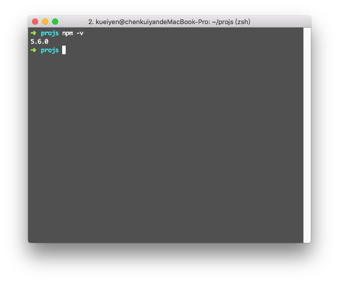
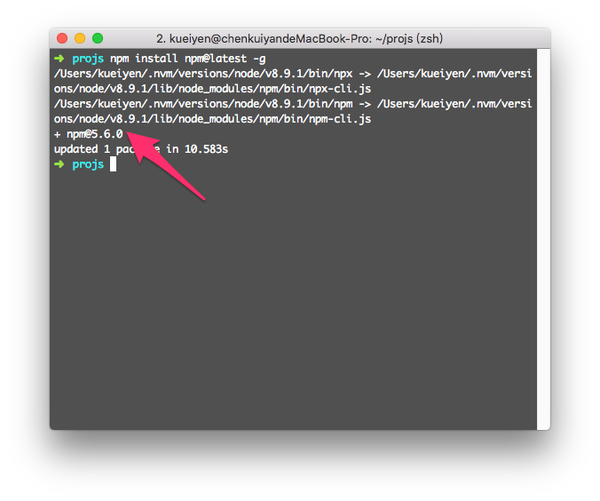

# 1. NPM


> 本教材撰寫於 Node.js 版本：v5.6.0

## 1.1 簡介
`npm` 全名為 `Node Package Manager`，是 Node.js 的開放式套件（package）管理與登記系統（[npmjs](https://www.npmjs.com/)），同時也是 Node.js 的預設套件管理系統，用來安裝與管理當前 Node 專案的套件。

安裝 npm 後，使用 npm install module_name 指令即可安裝新套件，維護管理套件的工作會更加輕鬆。

npm 可以讓 Node.js 的開發者，直接利用、擴充線上的套件庫（packages registry），加速軟體專案的開發。npm 提供很友善的搜尋功能，可以快速找到、安裝需要的套件，當這些套件發行新版本時，npm 也可以協助開發者自動更新這些套件。


npm 不僅可用於安裝新的套件，它也支援搜尋、列出已安裝模組及更新的功能。現在不只有 Node.js 的套件會放在上面，幾乎是所有 JS Open Source 軟體套件都會傳一份到上面便利所有開發者安裝 --- 也就是說，只要是 Public Package，你都可以免費發佈在 npm 上。

#### 參考連結
- [npm](https://www.npmjs.com/)
- [What is npm? | npm Documentation](https://docs.npmjs.com/getting-started/what-is-npm)

### 使用情境
- 管理專案中使用的錯綜複雜的外部套件，主要以後端和工具為主。

## 1.2 版本查詢
Node.js 在 0.6.3 版本開始內建 npm，每個 Node.js 版本都有預設對應的 npm 版本。

使用者可以使用下列指令查詢目前已經安裝的版本：

```shell
$ npm -v
```


## 1.3 更新 npm
npm 把自己也視為一個套件，所以 npm 的更新是比較有趣的部分。

當確認 npm 版本高於 `2.1.8` 時，你可以使用以下指令來更新 npm。執行後 npm 會回報更新後的版本號碼。

```shell
$ npm install npm@latest -g
```

如果目前版本是最新版本，會出現以下畫面：



#### 參考連結
- [Installing Node.js and updating npm | npm Documentation](https://docs.npmjs.com/getting-started/installing-node)

---

## 1.4 練習
- 檢查你的 npm 版本，並且記錄下來
- 嘗試使用指令更新 npm 版本，並且觀察結果
- 回報你的練習結果：`完成` / `失敗，因為...(簡述原因)`

--- 

# 接下來...
- [回目錄](../SUMMARY.md)
- [Node 套件管理 - NPM 必學指令](../npm-commands/index.md)
