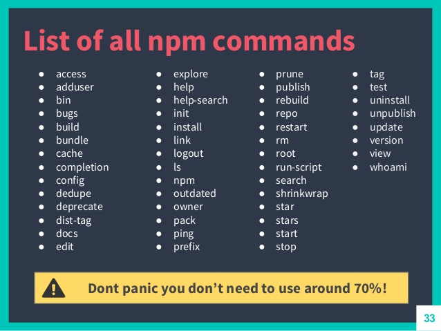

# NPM 套件管理


> 本教材撰寫於 Node 版本：v8.9.1
> 本教材撰寫於 npm 版本：v5.6.0


> 來源 [NPM THE GUIDE](https://www.slideshare.net/KameronTanseli1/npm-the-guide-51207206)

## 簡介

```shell
$ npm help
```


## 初始化專案

```shell
$ npm init [-f|--force|-y|--yes]
```

如果你加了 `-y` 或 `-f` 參數，代表你將認同使用預設的設定值來產生 `package.json` 檔。

#### 參考連結
- [init | npm Documentation](https://docs.npmjs.com/cli/init)


### 解析 package.json

```json
{
  "name": "demo",
  "version": "1.0.0",
  "description": "",
  "main": "index.js",
  "dependencies": {
    "nodemon": "^1.11.0"
  },
  "devDependencies": {
    "mocha": "^1.11.0"
  },
  "scripts": {
    "test": "echo \"Error: no test specified\" && exit 1"
  },
  "keywords": [],
  "author": "iamcxa <iamcxa@gmail.com>",
  "license": "ISC"
}
```

---

## 安裝套件

範例套件：[nodemon](https://nodemon.io/)


```shell
$ npm install {套件名稱}
# 別名
$ npm i {套件名稱}
# ex
$ npm install -g nodemon
```

### 參數
- `-g` 表示全域安裝
- `--save`：production
- `--save-dev`：development (預設)

#### 參考連結
- [install | npm Documentation](https://docs.npmjs.com/cli/install)

---

## 移除套件

```shell
$ npm uninstall -g {套件名稱}
$ npm uninstall --save {套件名稱}
$ npm uninstall --dev-save {套件名稱}
```

---

## 更新套件

```shell
$ npm update {套件名稱}
```

---

## 列出已安裝的全部套件

```shell
$ npm list
```

---

## 查看個別套件資訊

```shell
$ npm view {套件名稱}
```

```shell
$ npm list {套件名稱}
```

---

## 連結套件

```shell
$ npm link {套件名稱} {指定路徑}
# ex
$ npm link sandbox /proj/my-module
```

---

## 練習
- 使用 `npm init` 初始化一份 package.json
- 安裝指定模組
  * 安裝 `mocha` 於 `development` mode
  * 安裝 `axios` 於 `production` mode
- 新增一個叫做 `homework` 的 script，並且可以顯示 `helloworld` 訊息
- 回報你的練習結果：`完成` / `失敗，因為...(簡述原因)`