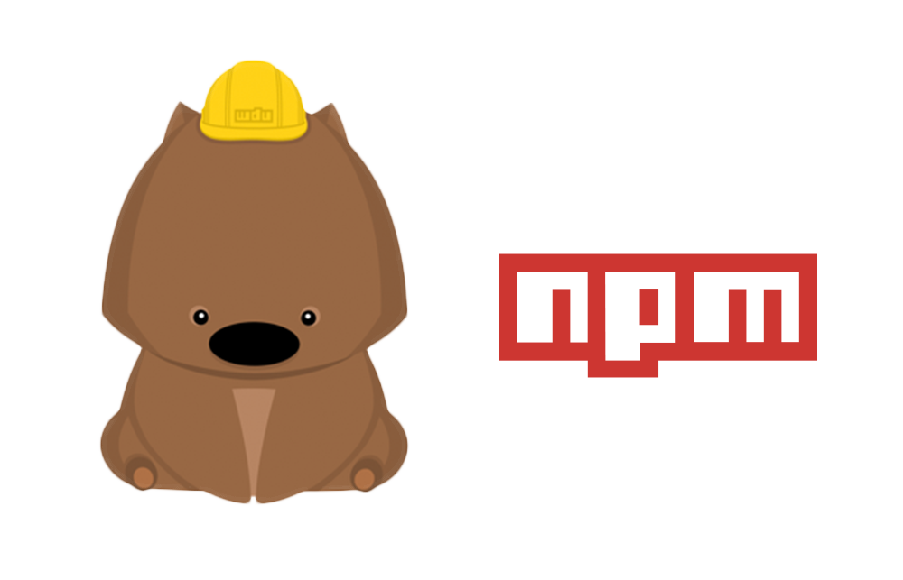

# 2. NPM 常用指令



> 本教材撰寫於 Node 版本：v8.9.1

> 本教材撰寫於 npm 版本：v5.6.0

## 2.1 簡介

### 查看全部指令
```shell
$ npm help
```


> 來源 [NPM THE GUIDE](https://www.slideshare.net/KameronTanseli1/npm-the-guide-51207206)

## 2.2 初始化專案

### 指令
```shell
$ npm init [-f|--force|-y|--yes]
```
如果你加了 `-y` 或 `-f` 參數，代表你將認同使用預設的設定值來產生 `package.json` 檔。

### 範例
```
npm init
npm init -y
npm init -f
```

### 結果
```json
{
  "name": "demo",
  "version": "1.0.0",
  "description": "",
  "main": "index.js",
  "dependencies": {
    "nodemon": "^1.11.0"
  },
  "devDependencies": {
    "mocha": "^1.11.0"
  },
  "scripts": {
    "test": "echo \"Error: no test specified\" && exit 1"
  },
  "keywords": [],
  "author": "iamcxa <iamcxa@gmail.com>",
  "license": "ISC"
}
```

### 參考連結
- [init | npm Documentation](https://docs.npmjs.com/cli/init)

## 2.3 解析 package.json

### name - 專案名稱
  - 必要欄位
  - 長度要小於或等於 214
  - 第一個字元不能是 `.` 或是 `_`
  - 第一個字元必須大寫
  - 此欄位最後會成為 URL 的一部分（https://www.npmjs.com/package/{name}）
  - 不可以使用 Node 核心模組的名稱
  - 不需要再名稱內再表示 `js`/`node`
  - 盡量不要跟人家撞名

### version
  - 必要欄位
  - 版本名稱必須是可解析的，例如 1.9.0
  - npm install {version} => npm install 1.9.0

### keywords
  - 字串陣列 ['a', 'b', 'c']
  - 配合指令 `npm search` 使用

### homepage
  - 套件的介紹網址

### bugs
  - 此套件的 issue tracker 連結或是 email
  - 配合指令 `npm bugs` 使用
  - json 格式，例如：
```
  { 
    "url" : "https://github.com/owner/project/issues",
    "email" : "project@hostname.com"
  }
```
### license
  - 建議使用
  - 任意授權規範 or `UNLICENSED`

### main
  - 專案進入點名稱
  - e.x. `main.js` / `app.js`...etc
  - require('main')

### dependencies
  - 此套件的相性套件
  - version 
  - >version 
  - >=version 
  - <version
  - <=version
  - ~version => ~1.2.3 := >=1.2.3 <1.3.0
  - ^version => ^1.2.3 := >=1.2.3 <2.0.0

### devDependencies
  - build/開發此套件時需要的相依性套件

### 參考連結
- [package.json | npm Documentation](https://docs.npmjs.com/files/package.json)

---

## 2.3 安裝套件

> 範例套件：[nodemon](https://nodemon.io/)


### 語法
```shell
$ npm install {套件名稱}
# 別名
$ npm i {套件名稱}
# ex
$ npm install -g nodemon
```

### 參數
- 不用參數
- `-g` 表示全域安裝
- `--save`：production
- `--save-dev`：development (預設)

### 範例

#### 安裝指定套件到全域
- 常用於安裝工具型套件
```
npm install -g nodemon
```

#### 安裝到專案，並將依賴寫入 dependencies
- 常用於專案本身就需要使用的套件
```
npm install --save nodemon
npm install -S nodemon
```

#### 安裝到專案，並將依賴寫入 devDependencies
- 常用於專案開發時才需要使用的套件
```
npm install --save-dev nodemon
npm install --D nodemon
```

#### 安裝專案下所有的套件
```
cd {專案目錄}

npm install
// 或
npm install --production
// 或
NODE_ENV=production npm install
```

#### 安裝指定版本的套件
- `@latest`：表示最新​​版本
```
npm install npm@latest -g
npm i nodemon@1.6.0
```

#### 安裝在 github 上的套件
- 一般來說就是沒有 release 到 NPM，但原始碼放在 github 的套件
```
npm i https://github.com/expressjs/express.git
```

### 參考連結
- [install | npm Documentation](https://docs.npmjs.com/cli/install)

---

## 2.4 移除套件
- 別名
  - `remove`
  - `rm`
  - `r`
  - `un`
  - `unlink`

### 指令
```shell
$ npm uninstall -g {套件名稱}
$ npm uninstall --save {套件名稱}
$ npm uninstall --dev-save {套件名稱}
```

### 範例
```
npm uninstall -g nodemon
npm uninstall --save nodemon
npm uninstall --dev-save nodemon
```

### 參考連結
- [uninstall | npm Documentation](https://docs.npmjs.com/cli/uninstall)

---

## 2.5 更新套件

### 語法
```shell
$ npm update {套件名稱}
```

### 範例
```
npm update
npm update nodemon
```

### 參考連結
- [update | npm Documentation](https://docs.npmjs.com/cli/update)

---

## 2.6 列出已安裝的全部套件

### 查看專案目錄下安裝的套件

#### 語法
```shell
$ npm list
```

### 查看全域安裝的套件

#### 語法
```shell
$ npm list -global
```

### 參考連結
- [ls | npm Documentation](https://docs.npmjs.com/cli/ls)

---

## 2.7 查看個別套件資訊

### 語法
```shell
$ npm view {套件名稱}
```

### 參考連結
- [view | npm Documentation](https://docs.npmjs.com/cli/view)

---

## 2.8 連結套件
- 使用情境：安裝放在 local 的套件

### 語法
```shell
$ npm link {套件名稱} {指定路徑}
# ex
$ npm link sandbox /proj/my-module
```

### 參考連結
- [link | npm Documentation](https://docs.npmjs.com/cli/link)

---

## 2.9 npm run & npm Script
- 你可以把它想成是 Hook，指定 npm 特定生命週期時，執行 script。
- 例如：(pretest) 測試前需要清除舊測試報表，(test) 測試時需要執行預先寫好的測試 bash，(posttest) 測試完成後需要發送測試結果的 email 給需要被告知的人

### 語法
```
$ npm run {script 名稱}
```

### 範例
```
  "scripts": {
    "start": "echo '執行 start' && exit 1",
    "test": "echo '執行 test' && exit 1",
    "preinstall": "echo '執行 preinstall'",
    "install": "echo '執行 install'",
    "postinstall": "echo '執行 postinstall'",
    "go": "echo gogogogo"
  }
$ npm run go
```

#### 參考連結
- [run-script | npm Documentation](https://docs.npmjs.com/cli/run-script)


## 2.10 練習
- 使用 `npm init` 初始化一份 package.json
  - 必須有你的個人資訊
- 安裝指定模組
  * 安裝 `mocha` 於 `development` mode
  * 安裝 `axios` 於 `production` mode
- 新增一個叫做 `homework` 的 script，並且可以顯示 `helloworld` 訊息
- 回報你的練習結果：`完成` / `失敗，因為...(簡述原因)`


# 接下來...
- [回目錄](../SUMMARY.md)
- [Node 版本管理 - 使用 NVM](../nvm-basic/index.md)
