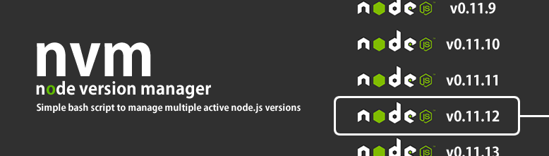
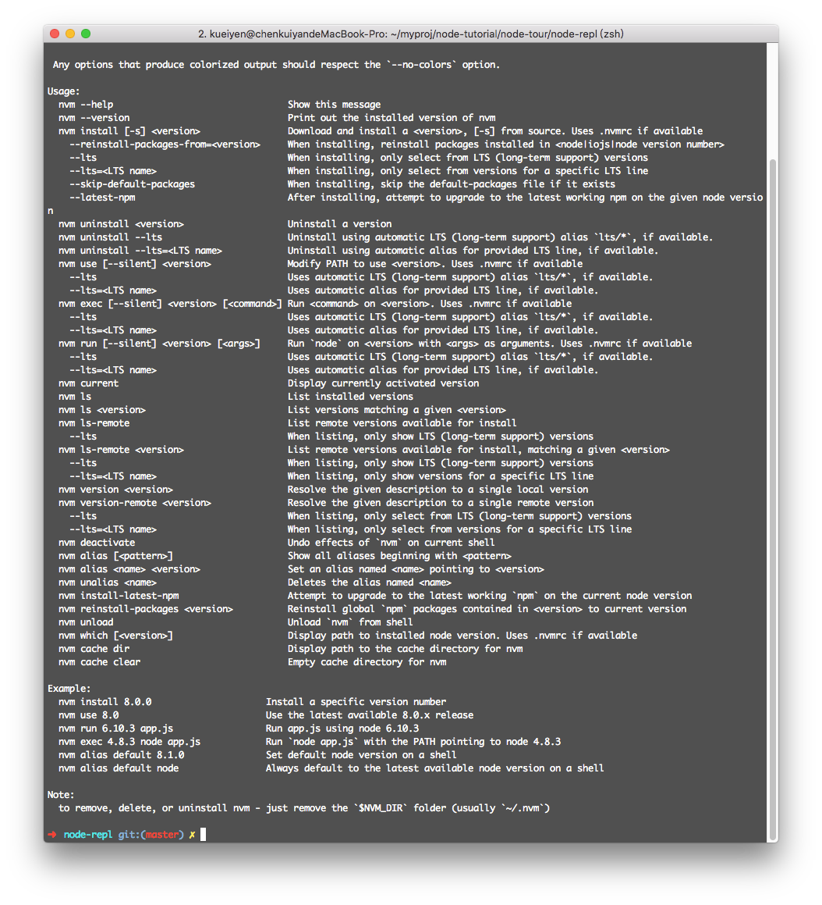
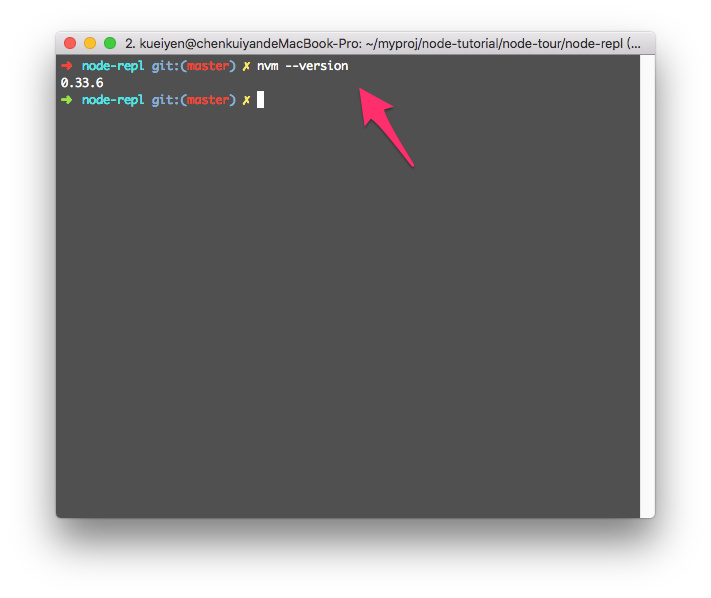

#  5. Node 版本管理 - 使用 NVM



> [圖片來源](http://davidcai.github.io/blog/posts/lets-use-nvm/)

> 本教材撰寫於 Node.js 版本：v8.9.1

> 本教材撰寫於 nvm(mac) 版本：v0.33.6

## 5.1 簡介

NVM 全名是 `Node Version Manager`，是用來管理 Node.js 版本的工具。由於 Nodejs 的版本更新速度飛快，而且每個主要版本都有些微差異，所以實務上是可能會需要頻繁地在專案之間切換版本。

而正確地使用 NVM，就可以做到快速的版本切換。

## 5.2 安裝與更新

### Windows
  - [nvm-windows](https://github.com/coreybutler/nvm-windows)：[下載](https://github.com/coreybutler/nvm-windows/releases)
  - 參考：[NVM for Windows 安裝與指令](http://trunk-studio.com/blog/nvm-for-windows/)

### Mac/Linux-base
  - [nvm](https://github.com/creationix/nvm)
  - 使用下列指令安裝
```
  curl -o- https://raw.githubusercontent.com/creationix/nvm/v0.33.8/install.sh | bash
```

## 5.3 nvm 指令查詢

```shell
$ nvm help
```


## 5.4 nvm 版本檢查
安裝完成之後，可以使用以下指令查詢目前使用的 nvm 版本。

```shell
$ nvm --version
```



## 5.5 檢查當前 node 版本
```shell
$ nvm current
```

## 5.6 列出系統已安裝的 node 版本
```shell
$ nvm ls
```

## 5.7 列出可以安裝的 node 版本
```shell
$ nvm ls-remote
$ nvm ls-remote --lts
```

## 5.8 安裝新的 node 版本

### 語法
```shell
$ nvm install v{版本號碼}
```

### 範例
```shell
$ nvm install v8.9.1
```

## 5.9 切換 node 版本

### 語法
```shell
$ nvm use v{版本號碼}
```

### 範例
```shell
$ nvm use v8.9.1
```

## 5.10 使用 nvm 設定預設的 node 版本

### 語法
```shell
$ nvm alias default v{版本號碼}
```

### 範例
```shell
$ nvm alias default v8.9.1
```

---

## 5.11 練習
- 自行安裝 nvm 環境於你自己的系統上
- 透過 nvm 安裝 Node.js `6.9.1` 以及 `8.9.1`
- 使用 nvm 設定預設的 Node.js 版本為 `8.9.1`
- 使用 nvm 切換你當前的 Node.js 版本為 `6.9.1`
- 回覆你的練習結果：`完成` / `失敗，因為...(簡述原因)`

---

# 接下來...
- [回目錄](../SUMMARY.md)
- [Node 初探 - 使用 Node-REPL](../node-basic/index.md)
